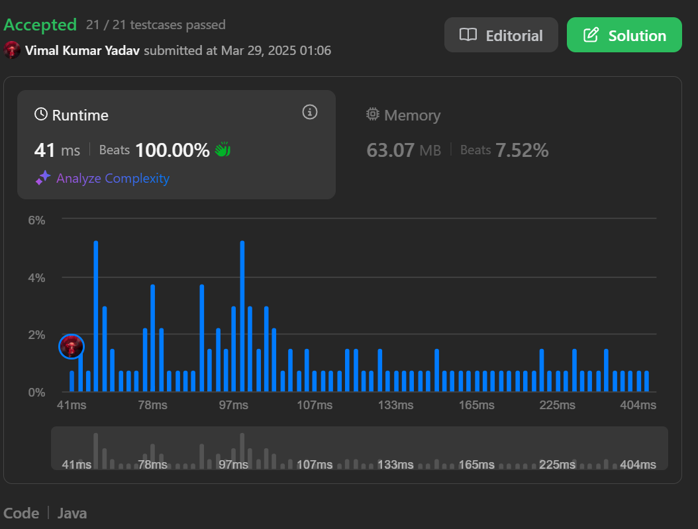

## What question says?

- According to question it wants us to calculate the number of cells we can reach whose value is less than our query (if the cell is already visited then do not increase the count)

## Approach 1 (Brute Force)

- We can travel each possible cells using recursion and increase the count according to our conditions for each query.

```
class Solution {
    public int[] maxPoints(int[][] grid, int[] queries) {
        int ans[] = new int[queries.length];
        int m = grid.length;
        int n = grid[0].length;
        for(int i = 0 ; i < queries.length ; i++){
            boolean[][] visited = new boolean[m][n];
            ans[i] = bfs(grid , visited , 0 , 0 , queries[i]);
        }
        return ans;
    }
    private int bfs(int[][] grid , boolean[][] visited , int i , int j , int target){
        if(i >= visited.length || i < 0 || j >= visited[0].length || j < 0 ) return 0;
        int count = 0;
        if(!visited[i][j] && grid[i][j] < target) count++;
        visited[i][j] = true;
        count += bfs(grid , visited , i + 1 , j , target);
        count += bfs(grid , visited , i - 1 , j , target);
        count += bfs(grid , visited , i , j + 1 , target);
        count += bfs(grid , visited , i , j - 1 , target);
        return count;
    }
}
```

**Time Complexity:-**

- For each query we will be travelling in the grid so the TC = O(Q _ m _ n).
  **Space Complexity:-**
- For each query we are creating a boolean 2d array of m _ n size so SC = O(Q _ m \* n)

## Apprach 2 (Optimized Approach)

- Sort the queries in ascending order (You will know reason in the below points).
- We will recursively explore the grid starting from top-left corner
- Cells with value less than query are counted and marked visited
- Cells with value equal or greater than query are stored in Priority Queue
- The Priority Queue stores the values in increasing order so that when we access queries with higher value then we can use them instead of travelling again and again.

```
class Solution{
    private int total = 0;
    private void dfs(int[][] grid , int query , int row , int col , PriorityQueue<int[]> greaterCell){
        if(row < 0 || col < 0 || row == grid.length || col == grid[0].length) return;
        if(grid[row][col] > 0){
            if(grid[row][col] < query){
                grid[row][col] = -1;
                total++;
                dfs(grid , query , row + 1, col , greaterCell);
                dfs(grid , query , row - 1, col , greaterCell);
                dfs(grid , query , row , col + 1, greaterCell);
                dfs(grid , query , row , col - 1, greaterCell);
            }else{
                greaterCell.add(new int[]{row , col , grid[row][col]});
                grid[row][col] = 0;
            }
        }
        while(!greaterCell.isEmpty()){
            int top[] = greaterCell.peek();
            if(top[2] < query ){
                greaterCell.remove();
                grid[top[0]][top[1]] = top[2];
                dfs(grid , query , top[0] , top[1] , greaterCell);
            }else{
                break;
            }
        }
    }
    public int[] maxPoints(int[][] grid, int[] queries) {
        int result[] = new int[queries.length];
        ArrayList<int[]> indexes = new ArrayList<>();
        for(int i = 0 ; i < queries.length ; i++) indexes.add(new int[]{queries[i] , i});
        Collections.sort(indexes , (a , b) -> Integer.compare(a[0] , b[0]));
        PriorityQueue<int[]> greaterCell = new PriorityQueue<>((a , b) -> a[2] - b[2]);
        for(int[] query : indexes){
            dfs(grid , query[0] , 0 , 0 , greaterCell);
            result[query[1]] = total;
        }
        return result;
    }
}
```

**Time Complexity:-**

- O(m _ n _ log(m\*n)), where m and n are grid dimensions
  **Space Complexity:-**
- O(m \* n)
  
