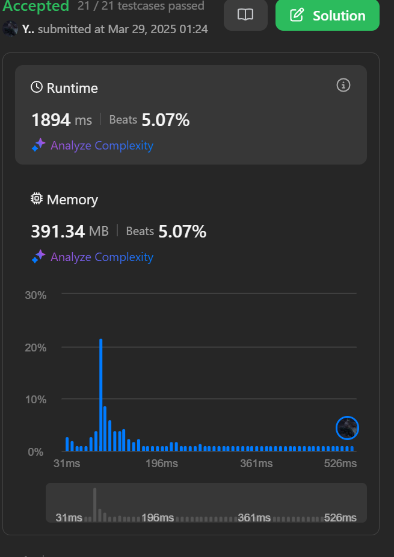

## Apprach 2 (Optimized Approach)

- Sort the queries in ascending order (You will know reason in the below points).
- We will recursively explore the grid starting from top-left corner
- Cells with value less than query are counted and marked visited
- Cells with value equal or greater than query are stored in Priority Queue
- The Priority Queue stores the values in increasing order so that when we access queries with higher value then we can use them instead of travelling again and again.

```
class Solution {
public:
    int total = 0;

    void dfs(vector<vector<int>>& grid, int query, int row, int col,
             priority_queue<vector<int>, vector<vector<int>>, greater<vector<int>>>& greaterCells) {
        if (row < 0 || col < 0 || row >= grid.size() || col >= grid[0].size()) return;
        if (grid[row][col] > 0) {
            if (grid[row][col] < query) {
                total++;
                int val = grid[row][col];
                grid[row][col] = -1;
                dfs(grid, query, row + 1, col, greaterCells);
                dfs(grid, query, row - 1, col, greaterCells);
                dfs(grid, query, row, col + 1, greaterCells);
                dfs(grid, query, row, col - 1, greaterCells);
            } else {
                greaterCells.push({grid[row][col], row, col});
                grid[row][col] = 0;
            }
        }
        while (!greaterCells.empty()) {
            vector<int> top = greaterCells.top();
            if (top[0] < query) {
                greaterCells.pop();
                grid[top[1]][top[2]] = top[0];
                dfs(grid, query, top[1], top[2], greaterCells);
            } else {
                break;
            }
        }
    }

    vector<int> maxPoints(vector<vector<int>>& grid, vector<int>& queries) {
        vector<int> result(queries.size());
        vector<pair<int, int>> sortedQueries;
        for (int i = 0; i < queries.size(); i++) {
            sortedQueries.push_back({queries[i], i});
        }
        sort(sortedQueries.begin(), sortedQueries.end());
        priority_queue<vector<int>, vector<vector<int>>, greater<vector<int>>> greaterCells;
        total = 0;
        for (auto& p : sortedQueries) {
            int query = p.first;
            int idx = p.second;
            dfs(grid, query, 0, 0, greaterCells);
            result[idx] = total;
        }
        return result;
    }
};


```

**Time Complexity:-**

- O(m _ n _ log(m\*n)), where m and n are grid dimensions
  **Space Complexity:-**
- O(m \* n)


